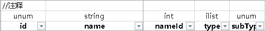

# Excel2Protobuffers
tools Excel to Protobuffers

可以讲Excel 转换为 Protobuffers 可以各种代码语言使用

注意：配置环境是 python3.11.7   第三方python包：openpyxl，openpyxl，numpy，protobuf

## 使用方法：
    1.配置config.ini文件
    excelDir                # excel目录
    outputBytesDir          # 生成的序列化数据目录
    outputCSDir             # 生成的CS目录
    outputConfigCSDir       # 生成的configCS目录

    2.配置customType.ini文件
    type : value            #type 自定义类型，配置在excel表头上的
                            #value 为对应proto支持的值类型 repeated类型的用[]包起来

    3.excel配表：
    
    如图所示，默认是第二行字段类型，第三行是字段名 
    如需修改，修改config.py的 
        TYPE_ROW = 2   # 第二行是字段类型
        NAME_ROW = 3   # 第三行是字段名
        DATA_ROW = 4   # 第四行是开始读数据位置数据
        
    4.执行run.bat 自动生成出对应语言代码及序列化的excel数据, 传参，文件名，支持多个， 无参就是整个excel目录 

## 支持类型：
    1.默认类型 
    'double',	# double
	'float',	# float
	'int32',	# int
	'int64',	# long
	'uint32',	# uint
	'uint64',	# ulong
	'sint32',	# int
	'sint64',	# long
	'fixed32',	# uint
	'fixed64',	# ulong
	'sfixed32',	# int
	'sfixed64',	# long
	'bool',		# bool
	'string',	# string

    2.默认数组类型
    ENABLEARRYLIST = [
    '[double]',
    '[float]',
    '[int32]',
	'[int64]',
	'[uint32]',
	'[uint64]',
	'[sint32]',
	'[sint64]',
	'[fixed32]',
	'[fixed64]',
	'[sfixed32]',
	'[sfixed64]',
	'[bool]',
 	'[string]',]
    
    3.自定义类型, 在config.py 的 CUSTOM_TYPES 中可以自定义

    CUSTOM_TYPES = {
    "num" : "int32",
    "unum" : "uint32",
    "str" : "string", 
    "ilist" : "[int32]", 
    "uilist" : "[uint32]", 
    "flist" : "[float]", 
    "slist" : "[string]",
    "blist" : "[bool]",
    }

